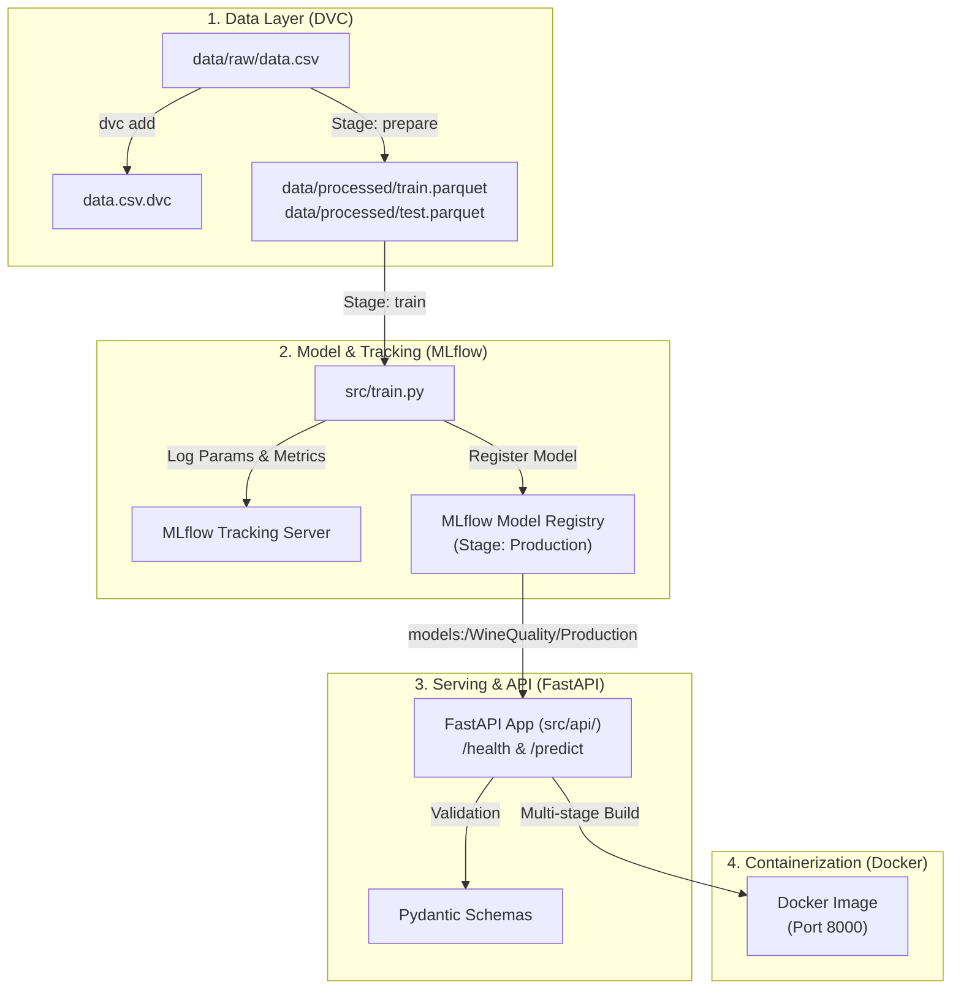

# 🚀 Project 1: End-to-End MLOps Pipeline

**Objective:** Build a complete, production-grade Machine Learning lifecycle system from raw data ingestion to containerized REST API deployment.

> **Working directory note (after the monorepo restructure).** This project now
> lives at `projects/01_diabetes_regression/`, and every path below is relative
> to **this folder**. Run shell commands from here unless a step says otherwise.
> Shared services stay at the repo root: the virtualenv, `requirements*.txt`,
> `mlflow.db`, the `.dvc` cache, and `pytest.ini`. The config file is
> `configs/config.yaml` (it used to be `train_config.yaml`).

---

## 🏗️ Architecture & Workflow



---

## 📋 Milestone Roadmap & Checklist

### 📍 Milestone 1: Data Versioning & Pipelines with DVC
**Goal:** Guarantee dataset reproducibility and build a multi-stage execution DAG.

- [x] **Step 1.1:** Save raw tabular dataset to `data/raw/data.csv`.
- [x] **Step 1.2:** Initialize DVC in the workspace:
  ```powershell
  dvc init
  ```
- [x] **Step 1.3:** Track raw data with DVC (`dvc add data/raw/data.csv`) and commit `.dvc` files to Git.
- [x] **Step 1.4:** Create `dvc.yaml` defining:
  - `prepare` stage: Reads `data/raw/data.csv`, outputs `data/processed/train.parquet` and `test.parquet`.
  - `train` stage: Reads processed parquets and `configs/config.yaml`, outputs trained model artifact `models/model.pkl`.
- [x] **Step 1.5:** Run and test pipeline caching:
  ```powershell
  dvc repro
  dvc dag
  ```

---

### 📍 Milestone 2: Experiment Tracking & Model Registry with MLflow
**Goal:** Track training iterations systematically and manage model releases.

- [x] **Step 2.1:** Configure `mlflow.db` as the SQLite backend for full Model Registry support:
  ```powershell
  mlflow ui --backend-store-uri sqlite:///mlflow.db --port 5000
  ```
- [x] **Step 2.2:** Run experiments with different hyperparameter configurations in `configs/config.yaml`:
  - Run 1: Baseline Random Forest (`n_estimators=100`, `max_depth=6`)
  - Run 2: Ridge Challenger (`alpha=1.0`)
  - Run 3: HistGradientBoosting Challenger (`max_iter=50`, `max_depth=3`)
- [x] **Step 2.3:** Compare runs side-by-side in MLflow UI ([http://localhost:5000](http://localhost:5000)).
- [x] **Step 2.4:** Register the best-performing model into the MLflow Model Registry as `DiabetesRegressor`.
- [x] **Step 2.5:** Promote the winning model to `@champion` alias with automated promotion gate.

---

### 📍 Milestone 3: Real-Time Inference Microservice with FastAPI
**Goal:** Expose the model as a robust REST API with input validation and automated testing.

- [x] **Step 3.1:** Create module structure `src/api/` (`schemas.py`, `app.py`).
- [x] **Step 3.2:** Define Pydantic request/response models with input validation rules.
- [x] **Step 3.3:** Implement endpoints:
  - `GET /health` (returns API status and model readiness)
  - `POST /predict` (accepts feature payload, loads `@champion` model from MLflow, returns predictions)
- [x] **Step 3.4:** Write automated API tests with `pytest` and `httpx` in `tests/test_api.py`.
- [x] **Step 3.5:** Run local server and test via Swagger UI at [http://localhost:8000/docs](http://localhost:8000/docs):
  ```powershell
  uvicorn src.api.app:app --reload --port 8000
  ```

---

### 📍 Milestone 4: Packaging & Containerization with Docker
**Goal:** Package the entire serving microservice into an immutable, portable Docker container.

- [x] **Step 4.1:** Write a production-grade multi-stage `Dockerfile` with a non-root user.
- [x] **Step 4.2:** Create `docker-compose.yml` linking the FastAPI service to the MLflow tracking store.
- [ ] **Step 4.3:** Build the Docker image (requires Docker Desktop to be installed):
  ```powershell
  docker build -t mlops-diabetes-api:v1 -f projects/01_diabetes_regression/Dockerfile .
  ```
- [ ] **Step 4.4:** Run and verify container locally:
  ```powershell
  docker run -p 8000:8000 --name diabetes-api mlops-diabetes-api:v1
  ```
- [ ] **Step 4.5:** Test live container endpoints using PowerShell or curl:
  ```powershell
  Invoke-RestMethod -Uri "http://localhost:8000/health" -Method Get
  ```

---

## 🛠️ Tech Stack Reference

| Tool | Role in MLOps |
| :--- | :--- |
| **Git + DVC** | Code and dataset versioning |
| **MLflow** | Experiment tracking, artifact storage, and model registry |
| **FastAPI + Pydantic** | High-performance inference serving with request validation |
| **Pytest** | Automated unit, smoke, and API testing |
| **Docker** | Microservice containerization and packaging |

---

## 🎯 Definition of Done (DoD)

1. `dvc repro` executes cleanly and re-runs only modified stages.
2. MLflow records all run parameters, metrics, and holds a `Production` tagged model in the registry.
3. `pytest` passes 100% of pipeline and API test cases.
4. FastAPI serves predictions locally and inside a Docker container with `< 50ms` latency.
